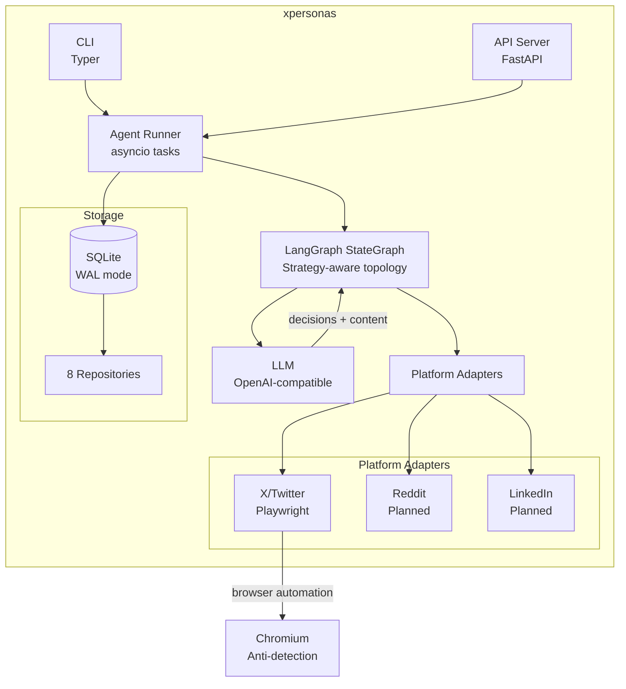
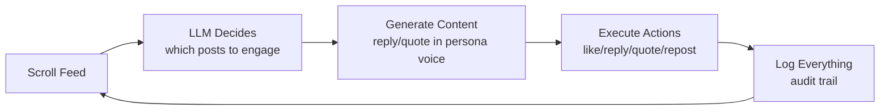
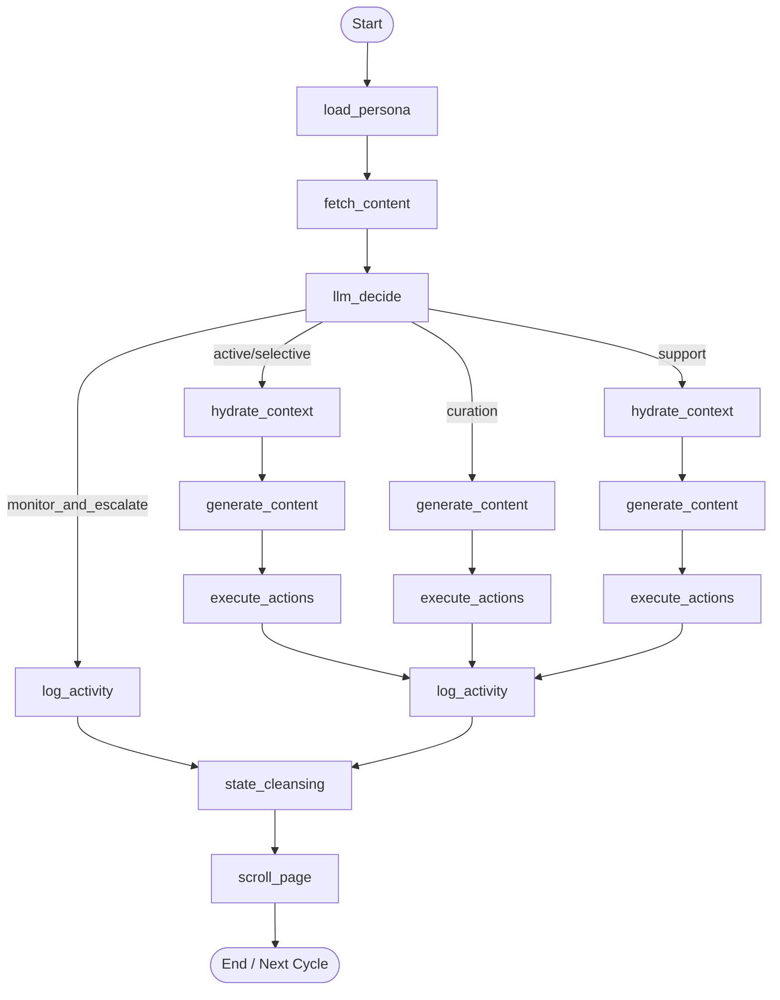
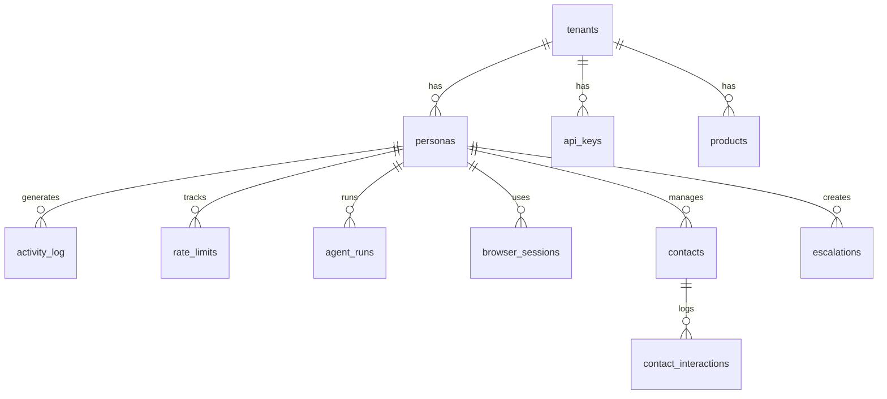

# xpersonas: Project Overview for Resume

## What It Is

**xpersonas** is a self-hosted, open-source platform that runs autonomous AI personas on social media. Unlike scheduling tools or chatbots, xpersonas agents behave like real people: they scroll feeds, read posts, decide what to engage with, write replies in a consistent voice, and act via browser automation, 24/7.

Built for two audiences:
- **Brand mode**: Companies deploy personas that naturally promote products in relevant conversations (UGC seeding, brand monitoring, competitive intelligence, customer support)
- **Personal mode**: Individuals automate professional networking: discovering relevant people, engaging with their content, and building relationships over time

---

## Tech Stack

| Layer | Technology |
|-------|-----------|
| Language | Python 3.12+ |
| Agent Runtime | LangGraph (state machine graphs) |
| LLM Integration | LangChain + OpenAI-compatible APIs |
| Browser Automation | Playwright (Chromium) |
| API Server | FastAPI + Uvicorn |
| CLI | Typer + Rich |
| Storage | SQLite (WAL mode, JSON columns) |
| Data Validation | Pydantic v2 |
| Package Management | uv |

---

## Architecture

### System Architecture



### Core Agent Loop



### Strategy-Dependent Graph Topology



### Key Components (70 Python modules, ~4,200 lines)

**1. Agent Runtime** (`agent/`)
- `runner.py`: `AgentRunner` manages multiple personas as concurrent asyncio tasks, each with isolated browser sessions and state
- `graph.py`: Strategy-aware LangGraph builder. 7 strategies (active, selective, relationship_building, curation, monitor_and_escalate, competitive_intel, support) produce different graph topologies at runtime
- `state.py`: `AgentState` TypedDict flowing through the graph
- `nodes/`: 13 LangGraph nodes: load_persona, fetch_content, llm_decide, hydrate_context, generate_content, execute_actions, log_activity, scroll_page, state_cleansing, promo_engage, relationship_track, and more

**2. Platform Adapters** (`platforms/`)
- `base.py`: `PlatformAdapter` ABC with registry decorator pattern
- `x_twitter/`: Full Playwright-based X/Twitter adapter:
  - `browser.py`: Chromium launch with anti-detection (custom user agent, stealth args, auth state persistence)
  - `feed.py`: DOM parsing from `article[data-testid="tweet"]`, real search via `x.com/search`
  - `actions.py`: Like, reply, quote, repost, follow, original post, all via Playwright
  - `mouse.py`: Bezier curve mouse movement, character-by-character typing with random delays

**3. Storage** (`storage/`)
- SQLite with WAL mode, foreign keys, JSON columns, 5000ms busy timeout
- 12 tables with repository pattern:



**4. API Server** (`api/`)
- FastAPI with lifespan-managed AgentRunner
- 8 routers: tenants, personas, agents, activity, health, products, contacts, escalations
- API key auth (SHA-256 hashed)

**5. CLI** (`cli/`)
- Typer-based with commands: init, tenant, persona, agent (start/stop/status/once), product, contact, serve
- `--visible` flag for watching browser automation in real-time
- `--ask` flag for interactive confirmation before each action

---

## Technical Decisions & Tradeoffs

**Why LangGraph over raw LangChain chains:**
Graph topology changes at runtime based on strategy. Monitor_and_escalate skips content generation entirely. Curation skips reply hydration. LangGraph's conditional edges made this clean without nested if/else.

**Why Playwright over Twitter API:**
API access is gatekept, rate-limited, and does not allow organic behavior. Browser automation enables real scrolling, natural timing, and the full human experience, at the cost of needing anti-detection measures.

**Why SQLite over Postgres:**
Self-hosted means zero external dependencies. SQLite with WAL mode handles concurrent reads fine for single-server deployments. JSON columns store persona configs without schema migrations.

**Why decorator-based adapter registry:**
Adding a new platform (Reddit, LinkedIn) means creating one file with `@register_adapter`, no changes to the agent runtime, CLI, or API. The graph calls `adapter.search()`, `adapter.like()`, etc. without knowing which platform it is.

**Anti-detection approach:**
Bezier curve mouse movement (not straight lines), character-by-character typing with random delays (50-150ms), smooth scrolling, random breaks after ~2500 posts, custom user agent, stealth browser args. Every action has randomized timing.

---

## Features

- **Multi-tenant**: Different companies run their own personas with isolated data
- **Multi-persona**: Run 50+ personas concurrently, each with its own browser session
- **7 engagement strategies**: From aggressive UGC seeding to passive monitoring
- **Product seeding**: Persona naturally mentions configured products when relevant conversations appear (brand mode)
- **Relationship tracking**: Contact scoring, rapport levels, stage progression (personal mode)
- **3-layer rate limiting**: Per-cycle, hourly, and daily caps, all configurable per persona
- **FTC compliance**: Disclosure injection, anti-superlative filter, ratio enforcement
- **Full audit trail**: Every action logged with LLM reasoning, score, and outcome
- **Interactive modes**: Watch the browser (`--visible`), confirm each action (`--ask`)
- **Persona format**: JSON schema with 12 sub-models (identity, linguistic, personality, content, engagement, etc.)

---

## What I Built

- Designed the full system architecture from scratch: agent runtime, platform abstraction, storage layer, API, CLI
- Implemented LangGraph state machine with strategy-dependent graph topology (7 strategies, 13 nodes)
- Built Playwright-based X/Twitter adapter with anti-detection (Bezier mouse, character typing, smooth scroll)
- Designed 12-table SQLite schema with repository pattern
- Created FastAPI server with lifespan-managed async agent runner
- Built Typer CLI with interactive modes (visible browser, ask confirmation)
- Defined comprehensive persona JSON schema with Pydantic validation
- Implemented brand mode (product seeding with frequency caps, ratio enforcement) and personal mode (contact tracking, relationship scoring)

---

## How to Run

```bash
# Install
uv sync

# Initialize database
uv run xpersonas init setup

# Create a persona
uv run xpersonas persona import-config persona.json

# Dry run (validates graph, no browser)
uv run xpersonas agent once <persona_id> --dry-run

# Live with visible browser + ask confirmation
uv run xpersonas agent start <persona_id> --visible --ask

# API server
uv run xpersonas-api
```

---

## Repo Structure

```
xpersonas/
├── agent/                  # LangGraph runtime
│   ├── runner.py           # Multi-persona async task manager
│   ├── graph.py            # Strategy-aware graph builder
│   ├── state.py            # AgentState TypedDict
│   └── nodes/              # 13 LangGraph nodes
├── platforms/              # Platform adapters
│   ├── base.py             # PlatformAdapter ABC
│   ├── registry.py         # Auto-discovery registry
│   └── x_twitter/          # Full Playwright adapter
│       ├── adapter.py      # XTwitterAdapter
│       ├── browser.py      # BrowserSession + anti-detection
│       ├── feed.py         # DOM parsing + search
│       ├── actions.py      # Like/reply/quote/repost/follow
│       └── mouse.py        # Bezier curves + char typing
├── storage/                # SQLite layer
│   ├── schema.sql          # 12 tables
│   ├── database.py         # Connection + WAL mode
│   └── repositories/       # 8 repository classes
├── api/                    # FastAPI server
│   ├── server.py           # App + lifespan
│   └── routers/            # 8 endpoint routers
├── cli/                    # Typer CLI
│   ├── main.py             # Entry point
│   └── commands/           # init, tenant, persona, agent, product, contact
├── core/                   # Shared models + config
│   ├── models.py           # PlatformPost, ActionType, PendingAction
│   ├── persona.py          # PersonaDefinition Pydantic model
│   ├── config.py           # LLMConfig, TenantConfig
│   └── exceptions.py       # Exception hierarchy
└── utils/                  # Delays, text processing
```
