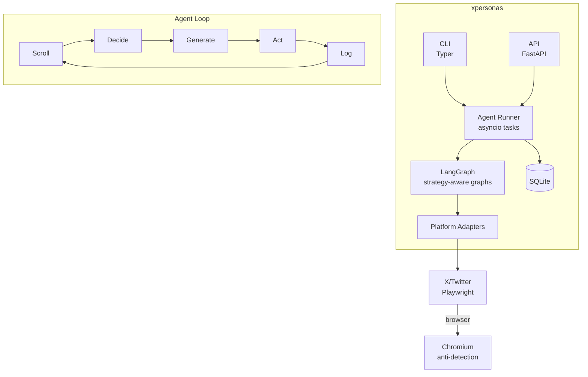

# xpersonas

Self-hosted platform for running autonomous AI personas on social media.

Define a persona. Agent lives that identity. Scrolling, reading, engaging, posting like a real human.

> **Not** a scheduling tool, analytics dashboard, or chatbot. It's an autonomous agent.

---

<!-- TODO: add screenshot or screen recording here -->
<!--  -->

---

## Architecture



[Full architecture docs](docs/ARCHITECTURE.md)

---

## Quick start

### Prerequisites

- Python 3.12+
- OpenAI-compatible API key
- Chromium (via Playwright)

### Install

```bash
git clone <repo-url> && cd x-personas
uv sync
playwright install chromium
```

### Configure LLM

```bash
export OPENAI_API_KEY="sk-..."
export OPENAI_MODEL="your-model"
```

### Initialize and run

```bash
# Setup database + first tenant
xpersonas init setup --db xpersonas.db --tenant-name "MyCompany"

# Create a persona
xpersonas persona create --db xpersonas.db --tenant-id <id> --handle "mybot" --display-name "My Bot" --strategy "active"

# Start agent (headless)
xpersonas agent start <persona_id> --db xpersonas.db

# Or watch it work (visible browser + confirm each action)
xpersonas agent start <persona_id> --visible --ask

# Dry run (validates graph, no browser)
xpersonas agent once <persona_id> --dry-run
```

---

## Docs

| Doc | What's in it |
|-----|-------------|
| [Architecture](docs/ARCHITECTURE.md) | System design, agent runtime, graph topology, storage schema |
| [Persona format](docs/PERSONA_FORMAT.md) | Full JSON schema with all fields |
| [Building personas](docs/BUILDING_PERSONAS.md) | Step-by-step guide with examples |
| [CLI reference](docs/CLI.md) | Every command and option |
| [API reference](docs/API.md) | All REST endpoints |
| [Safety](docs/SAFETY.md) | Anti-detection, rate limiting, FTC compliance |

---

## License

MIT
