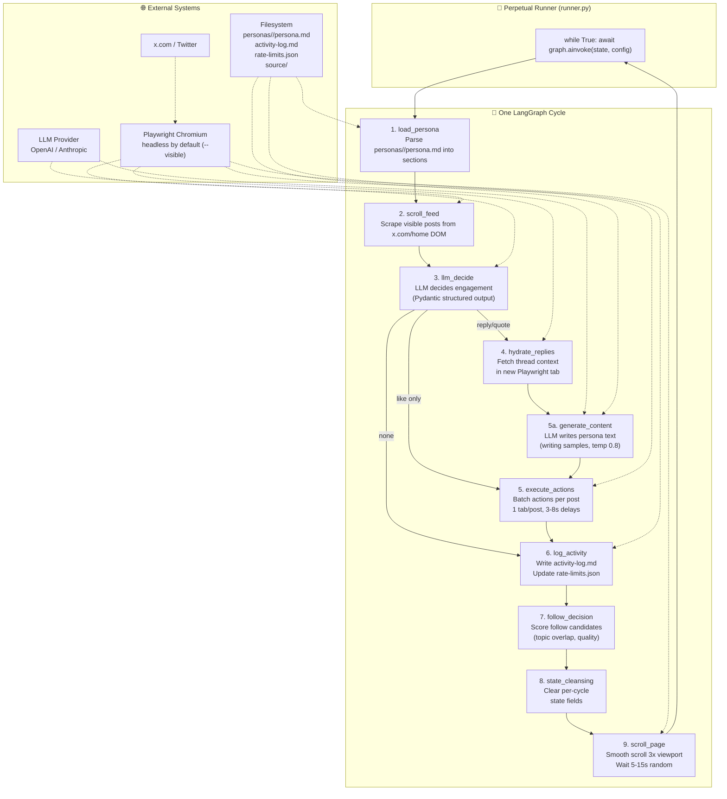

# X Personas

Autonomous X/Twitter agent that loads a structured persona, scrolls the home feed, decides engagements using an LLM, generates in-character responses, and executes actions via Playwright.



## Quick Start

### 1. Setup
```bash
git clone <repo> && cd x-persona
uv sync
cp .env.example .env # Add your LLM keys
```

### 2. Authenticate
```bash
# Log in manually once to save auth.json session in your persona directory
uv run python -m x_personas.agent.runner --persona purusha --visible --once
```

### 3. Generate Persona
```bash
uv run python -m x_personas.generate_persona <raw-samples>.md
# Output goes to personas/<handle>/persona.md
```

### 4. Run Agent
```bash
# Dry run (test LLM decisions, no browser)
uv run python -m x_personas.agent.runner --persona purusha --dry-run

# Continuous Loop (Default)
uv run python -m x_personas.agent.runner --persona purusha

# With VLM for multimodal image analysis
# (set VLM_MODEL=gpt-4o in .env)
uv run python -m x_personas.agent.runner --persona purusha --visible --ask

```

## CLI Reference

| Flag | Default | Description |
|---|---|---|---|
| `--persona` | *required* | Persona name (`purusha`) resolves to `personas/purusha/persona.md`; explicit paths also work |
| `--scroll-limit` | `2500` | Max scrolls before taking a 10-30 min break |
| `--browser` | none | Custom Chromium binary file path |
| `--visible` | off | Run headed (shows standard Chromium window) |
| `--dry-run` | off | Test LLM decisions against mock data without launching browser |
| `--once` | off | Run a single cycle and exit |
| `--ask` | off | Interactive approval gate: confirm actions in terminal before executing |
| `--no-cursor` | off | Disable DOM mouse cursors and clicking ripples in visible mode |
| `--auth` | `personas/<name>/auth.json` | Custom path to save/load browser session state |
| `--quiet` | off | Suppress debug logging |

### 🤖 Model Configuration

All settings fall through: CLI flag → env var → default.

#### Text LLM (for original post generation, etc.)

```env
OPENAI_API_KEY=sk-...
OPENAI_MODEL=gpt-4o-mini
OPENAI_BASE_URL=https://api.openai.com/v1
```

#### VLM (Vision Language Model — optional)

If `VLM_MODEL` is not set, multimodal features (image analysis in feed decisions and reply generation) are **disabled** — the text LLM handles everything without images.

```env
VLM_MODEL=gpt-4o
VLM_API_KEY=    # optional, falls back to OPENAI_API_KEY
VLM_BASE_URL=   # optional, falls back to OPENAI_BASE_URL
```

All model configuration is read from `.env` only — no CLI flags for model/api-key/base-url.

## Features & Pacing
* **Safe Delays:** 3–8s between actions, 5–15s between scrolls, 10–30 min break after `--scroll-limit` (default 2500 viewports).
* **Auto-Sync:** Updates profile stats in `personas/<name>/persona.md` at startup.
* **Strict Limits:** Enforces hourly and daily rate limits for likes, replies, quotes, reposts, and follows.
* **Tab isolation:** Opens a single tab per post to perform all actions, then closes it.
