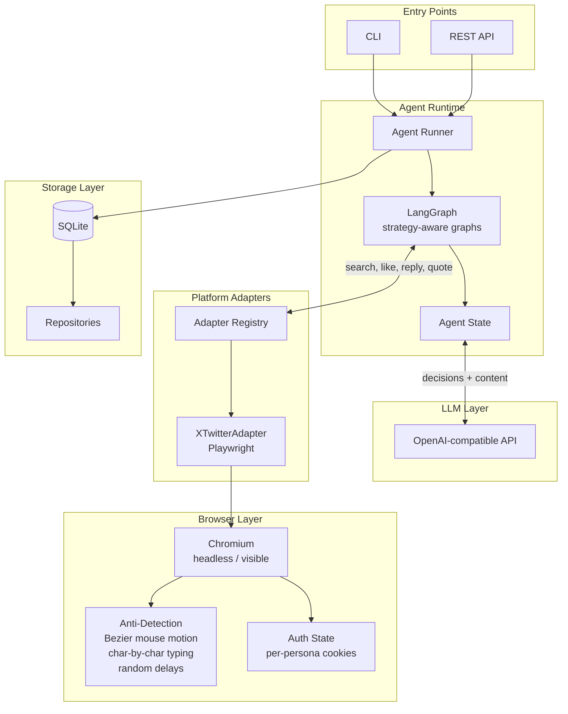

# xpersonas

Self-hosted platform that runs automated personas on social media.

You define a persona (voice, interests, behavior). The agent scrolls feeds, reads posts, decides what to engage with, writes replies in that persona's voice, and posts them. Runs 24/7.

---

<!-- TODO: add screenshot or screen recording here -->
<!--  -->

---

## Architecture



### How the agent loop works

Each cycle, the agent:

1. **Loads persona** — parses config, resolves strategy
2. **Fetches content** — scrolls feed or searches topics
3. **LLM decides** — scores each post, returns actions (reply, like, quote, repost)
4. **Hydrates context** — for replies, fetches thread to see what others said
5. **Generates content** — LLM writes reply/quote in persona's voice
6. **Executes actions** — Playwright clicks, types, scrolls (with anti-detection)
7. **Logs** — every action recorded with reasoning and score
8. **Tracks relationships** — updates contact rapport and stage
9. **Scrolls** — smooth scroll, increments counter, checks break threshold

The graph changes based on strategy. `monitor_and_escalate` skips steps 4-6 entirely. `curation` skips step 4. `support` only does replies.

### Strategies

| Strategy | What it does |
|----------|-------------|
| `active` | Full loop — search, decide, generate, execute, track |
| `selective` | Same loop, higher score threshold before acting |
| `relationship_building` | Fewer actions, more contact tracking |
| `curation` | Quote and original posts, no reply threads |
| `support` | Reply-only to customer questions |
| `monitor_and_escalate` | Log everything, no actions, webhook alerts |
| `competitive_intel` | Log competitor mentions, no actions |

[Full architecture docs](docs/ARCHITECTURE.md)

---

## Quick start

### Prerequisites

- Python 3.12+
- OpenAI-compatible API key
- Chromium (via Playwright)

### Install

```bash
git clone <repo-url> && cd x-personas
uv sync
playwright install chromium
```

### Configure LLM

```bash
export OPENAI_API_KEY="sk-..."
export OPENAI_MODEL="your-model"
```

### Initialize and run

```bash
# Setup database + first tenant
xpersonas init setup --db xpersonas.db --tenant-name "MyCompany"

# Create a persona
xpersonas persona create --db xpersonas.db --tenant-id <id> --handle "mybot" --display-name "My Bot" --strategy "active"

# Start agent (headless)
xpersonas agent start <persona_id> --db xpersonas.db

# Or watch it work (visible browser + confirm each action)
xpersonas agent start <persona_id> --visible --ask

# Dry run (validates graph, no browser)
xpersonas agent once <persona_id> --dry-run
```

---

## Docs

| Doc | What's in it |
|-----|-------------|
| [Architecture](docs/ARCHITECTURE.md) | System design, agent runtime, graph topology, storage schema |
| [Persona format](docs/PERSONA_FORMAT.md) | Full JSON schema with all fields |
| [Building personas](docs/BUILDING_PERSONAS.md) | Step-by-step guide with examples |
| [CLI reference](docs/CLI.md) | Every command and option |
| [API reference](docs/API.md) | All REST endpoints |
| [Safety](docs/SAFETY.md) | Anti-detection, rate limiting, FTC compliance |

---

## License

MIT
