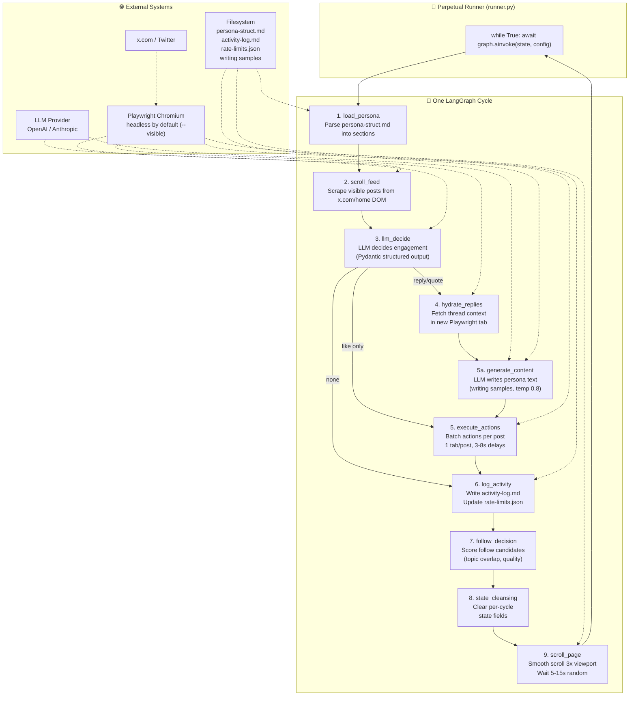

# X Personas

Autonomous X/Twitter agent that loads a structured persona, scrolls the home feed, decides engagements using an LLM, generates in-character responses, and executes actions via Playwright.



## Quick Start

### 1. Setup
```bash
git clone <repo> && cd x-persona
uv sync
cp .env.example .env # Add your LLM keys (DASHSCOPE_API_KEY, etc.)
```

### 2. Authenticate
```bash
# Log in manually once to save auth.json session
uv run python -m src.agent.runner --persona <your-persona>.md --visible --once
```

### 3. Generate Persona
```bash
uv run python -m src.generate_persona <raw-samples>.md
```

### 4. Run Agent
```bash
# Dry run (test LLM decisions, no browser)
uv run python -m src.agent.runner --persona persona-struct.md --dry-run

# Continuous Loop (Default)
uv run python -m src.agent.runner --persona persona-struct.md --provider dashscope

# Interactive Mode (Requires manual approval before each action)
uv run python -m src.agent.runner --persona persona-struct.md --provider dashscope --model qwen-vl-max --visible --ask

```

## CLI Reference

| Flag | Default | Description |
|---|---|---|
| `--persona` | *required* | Path to the persona definition markdown file |
| `--provider` | `openai` | LLM provider to use (`openai`, `anthropic`, or `dashscope`) |
| `--model` | *automatic* | LLM model name (defaults to env var or provider default: `gpt-4o-mini`, `qwen-vl-max`, `claude-3-5-sonnet-latest`) |
| `--api-key` | None | API key override (defaults to environment keys) |
| `--base-url` | None | Custom base URL override (specifically useful for custom endpoints) |
| `--auth` | *automatic* | Custom path to save/load browser session state (defaults to `auth-<persona>.json` to isolate accounts) |
| `--scroll-limit` | `2500` | Max scrolls before taking a 10-30 min break |
| `--browser` | None | Custom Chromium binary file path |
| `--visible` | off | Run headed (shows standard Chromium window) |
| `--dry-run` | off | Test LLM decisions against mock data without launching browser |
| `--once` | off | Run a single cycle and exit |
| `--ask` | off | Interactive approval gate: confirm actions in terminal before executing |
| `--no-cursor` | off | Disable DOM mouse cursors and clicking ripples in visible mode |
| `--quiet` | off | Suppress debug logging |

### 🤖 Selecting Provider & Model

You can select and run models in three ways:

1. **Explicit CLI overrides (Highest priority):**
   ```bash
   uv run python -m src.agent.runner --persona persona-struct.md --provider dashscope --model qwen-vl-max
   ```
2. **Provider-Aware Defaults (Omit `--model`):**
   If you specify the `--provider` but omit `--model`, the runner automatically falls back to recommended defaults:
   * `--provider dashscope` -> Defaults to `qwen-vl-max`
   * `--provider anthropic` -> Defaults to `claude-3-5-sonnet-latest`
   * `--provider openai` -> Defaults to `gpt-4o-mini`
3. **Environment variables (Standard setup):**
   Add default models directly inside your `.env` file (copied from `.env.example`):
   ```env
   DASHSCOPE_MODEL=qwen-vl-max
   OPENAI_MODEL=gpt-4o-mini
   ANTHROPIC_MODEL=claude-3-5-sonnet-latest
   ```

## Features & Pacing
* **Safe Delays:** 3–8s between actions, 5–15s between scrolls, 10–30 min break after `--scroll-limit` (default 2500 viewports).
* **Auto-Sync:** Updates profile stats in `<persona>-struct.md` at startup.
* **Strict Limits:** Enforces hourly and daily rate limits for likes, replies, quotes, reposts, and follows.
* **Tab isolation:** Opens a single tab per post to perform all actions, then closes it.
